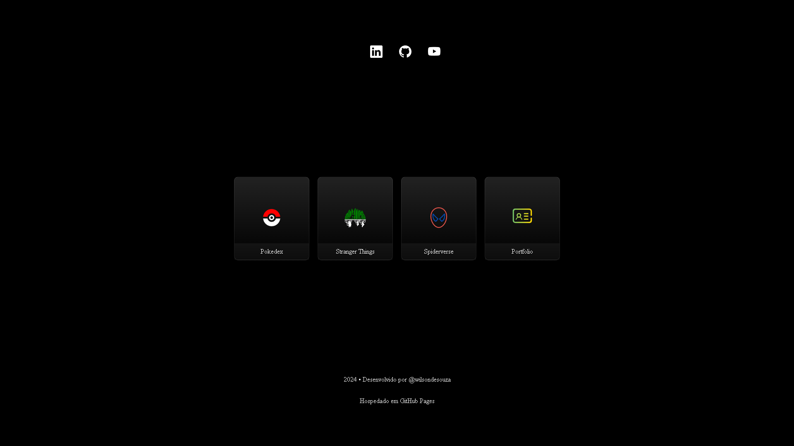

# Projetos FrontEnd

## 📒 Descrição
Neste repositório está reunido alguns games e desafios desenvolvidos para conclusão do bootcamp Ri Happy - Front-end do Zero
Favor navegar entre as pastas para acessar os conteúdos.

## 📝 Sumário

1. [Pokedex](https://github.com/wilsondesouza/projetos-frontend/tree/main/pokedex)
2. [Mundo Invertido](https://github.com/wilsondesouza/projetos-frontend/tree/main/mundo-invertido)
3. [Multiverso Spider-Man](https://github.com/wilsondesouza/projetos-frontend/tree/main/multiverso-homem-aranha)
4. [Portfólio](https://github.com/wilsondesouza/projetos-frontend/tree/main/portfolio-pessoal)

## 🔎 Saiba Mais
Navegar entre as pastas para acessar cada projeto com sua própria documentação.

## 🛠️ Como Utilizar
Você pode acessar o portal por [aqui](https://wilsondesouza.github.io/projetos-frontend/) OU [aqui](https://projetos-frontend.vercel.app/) e nele basta escolher qual projeto deseja visualizar

> Confira um exemplo visual abaixo:

